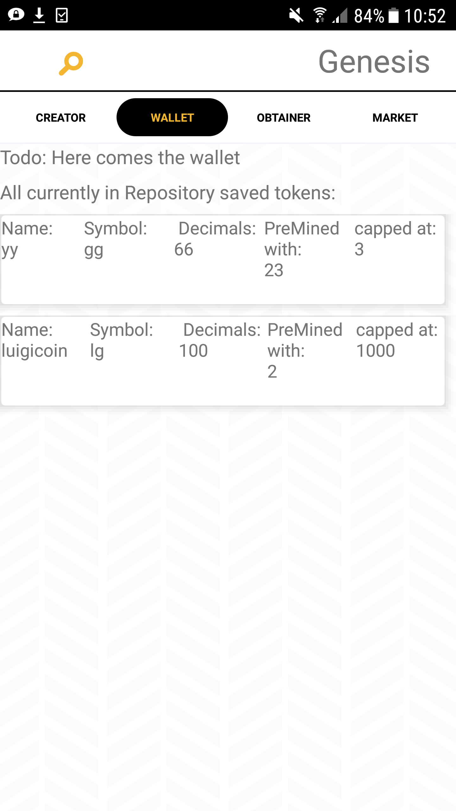

# GenesisApp

Mobile Application, which allows the user to create, deploy, utilize and obtain tokens.
It uses the Genesis Library. If you are interested in the library, check out: www.github.com/FuturICT2/Genesis. In case of questions,  please contact: bmark@ethz.ch.

# Installation
* clone the repository to your pc
* install adroid studio on our pc: https://developer.android.com/studio/index.html
* open the project with android studio
* Connect a phone through usb to your pc or start an emulator
* Run the project, it will be deployed to your phone or emulator

# Functions of GenesisApp

The app currently consists of four views. These will be explained in the following. 

## Token crator

The creator view allows the user to create a new token with different properties, underlyings and operations. Currently only basic properties can be defined:
* name: Name of the Token
* symbol: Short string representation of the token name. I.e. BTC is the symbol of bitcoin
* Maximum supply: Token cap. I.e. bitcoin has a token cap of 21 million. 
* Decimals: How many decimal position should the token have. I.e. Euro has two (100 cents)
* Genesis supply: Number of tokens which were pre-mined

In Challenge 1: You can use this view to directly store your created tokens to the blockchain of your chosing. 

## Wallet

In future all different types of tokens will be displayed and the balance of the user will be shown. Currently, it only lists the tokens existing in the local SQLite datase

## Token Obtainer
In future, the user will be able to select a token in this view. This token will then dipslay an action (task), which the user has to perform. If the action is accepted as true, the user will be rewarded with tokens.

In Challenge 2, you can use this view to test your implementation and to integrate it with other parts of the tool.

## Projects
In future, the user will be able to trade his or her
tokens in this view. Moreover, projects can be listed, on which the user can spend his or her tokens (crowdsourcing etc.)
 
# First Run
* after starting the app, you will see your empty wallet
* swipe left to the Creator
* For the moment, you can specify in this view the (basic) properties of the token you want to create. Make sure to save each input.
* After saving the Token ("save Token"-button), it will be shown in the wallet overview. Just swipe back (right) to the wallet view.

  
  

# How to utilize the App to implement your own Functionalities (BIOTS Challenges)

In the following, we briefly explain, how the Genesis AndroidApp and the Genesis library can be used to boost your development process. 

We often got asked, how to differentiate between the two challenges. In the next section we will explain it in detail, but briefly:  

* Token creator: Its basically replacing the SQLite database in the android app with a distributed ledger technology (i.e. Ethereum) - it is a "blockchain" intense challenge

* Token obtainer: extend the Operation interface and implement actions and proofs to account for your problem, which you want to solve through incentivizing a specific behavior/ action. This challenge is more about utilizing IoT and oracles to validate if an action has actually happened. For this challenge you can pretend, that the android application is storing everythin to a DLT (i.e. Ethereum) (use it as a black box). It is a IoT/ Oracle intense challenge.

Of course, both parts can be combined and this would be the ultimate killer applciation ;)

## Challenge 1

For this challenge, you can use the android application as it is and try to replace the SQLite database with a DLT (i.e. Ethereum). Some basic properties can already be defined inside the app. Hence, you can start with bringing these properties to the blockchain and afterwards think about more complex properties etc. 

For this, you need to implement the "IRepository" interface, which will be repsonsible for writing and retrieving information from the DLT (i.e. Ethereum). 

There is currently no library available, which allows developers to easily create tokens in java and to deploy them to Ethereum. Even a simple library will be a big contribution to the community :)

## Challenge 2
In this challenge, you will impelement a own custom operation, which can be performed with a token. 
For this you need to implement the Operation interface, create your own action(s), which this operation support, and the proof for the operations. 

For the start, you can use the SQLite implementation of the IRepository interface and assume, that your operations etc. are stored on the DLT (i.e. Ethereum). 
In practice, you will need to add some functions/ tables to the SQLite database. Look at the example code for hints how you can do this (in case of questions, just ask us). 

In the end, you will need to add your operation as a feature to the "Token Creator". 
Afterwards you will be able to test your token on the phone :)

# Software Architecture
